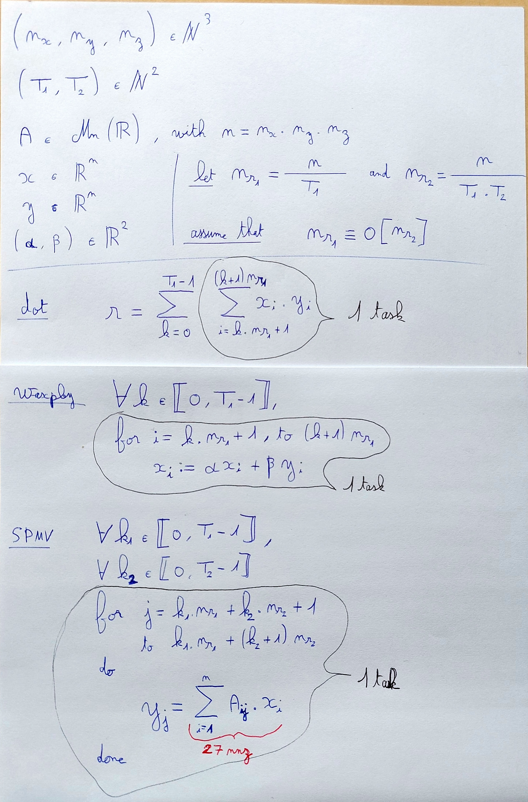

# About this repository

See `README.orig.md` for original read-me instructions.

## Parameters
Parameters are : [nx] [ny] [nz] [k] [T1] [T2] with
- nx, ny, nz the size of the problem
- k the number of iterations
- T1 the number of tasks decomposing operations 
- T2 the number of tasks re-decomposing SPMV operations

## Versions

Every versions support MPI parallelisation.

### omp-pf
The parallelisation is achieved with OpenMP `parallel-for` - this is the original repository code.
The parameters `T1` and `T2` are ignored.

### oss
The parallelisation is achieved with OmpSs-2 tasks - it is a porting of the mpc version.

### mpc
The parallelisation is achieved with OpenMP tasks.
However, a few MPC-specific optimizations have been added to enable better performances, that is :
- task dependencies pre-allocation and computation.
- `inoutset` reset mecanism - to remove useless inter-iteration arcs while creating multiple `inoutset` dependencies on the same data, without `inout` in between.

Here is a table to illustrate tasks decomposition

| Fields                            |         |         |         |
|-----------------------------------|---------|---------|---------|
| nx                                | 64      | 64      | 64      |
| ny                                | 64      | 64      | 64      |
| nz                                | 64      | 64      | 64      |
| T1                                | 16      | 16      | 32      |
| T2                                | 8       | 16      | 8       |
| n                                 | 262,144 | 262,144 | 262,144 |
| Tasks per ddot/waxpby operation   | 16      | 16      | 16      |
| Tasks per SPMV operation          | 128     | 256     | 256     |
| Vector lines per ddot/waxpby task | 16,384  | 16,384  | 8,192   |
| Vector lines per SPMV task        | 2,048   | 1,024   | 1,024   |

For efficient runs, tasks grain should vary from 0.1 ms. to 100 ms - otherwise, the runtime overhead will prevale.
Here is a few ideas for tasks decomposition, to ensure enough parallelism and efficient task grain.
- `T1` should be set so that `65,536 < n/T1 < 16,777,216`
- `T2 >= max(8, number of threads)` - to balance task grains, and generate enough parallelism

Here is how the computation is taskified 
